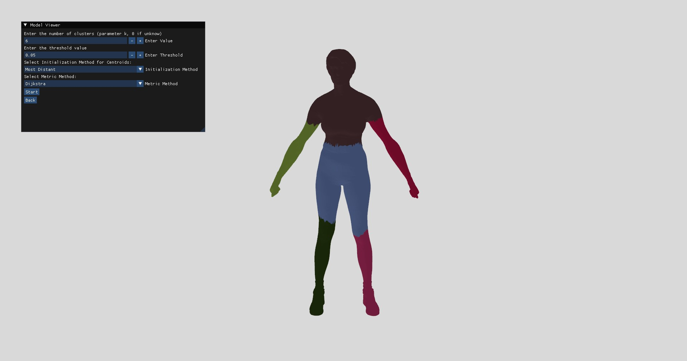

## Index
1. [Introduction](#introduction)
2. [Features](#features)
3. [Installation](#installation)
4. [Dataset](#dataset)
5. [Usage](#usage)
6. [Viewer](#viewer)
7. [Documentation](#documentation)

# Introduction
 This repository provides an interactive implementation of **mesh segmentation**, leveraging the **K-Means clustering algorithm**. You can use this project to segment 3D meshes efficiently while still having the flexibility to apply K-Means clustering independently.

## Features
- Flexible K-Means Usage: The K-Means implementation can also be used separately for general clustering tasks, offering versatility.
- Mesh Segmentation Using Dijkstra's Algorithm: Utilize Dijkstra's algorithm for an alternative segmentation method, focusing on shortest paths within the mesh.
- Mesh Segmentation Using Heat Equation: Segment 3D models based on the heat equation, providing a smooth and efficient way to divide the mesh into distinct regions.
- Centroid Initialization Methods: Support for various initialization techniques, including random, most distant points, and density-based approaches to improve clustering results.
- Automatic K-Detection: Automatically determine the optimal number of clusters using methods like silhouette scores and the elbow method.
- Mesh Exporting: Export segmented meshes for further analysis or processing in different formats.
- Visualization Tools: View segmented meshes in an interactive window with color-coded clusters, making it easier to interpret the results visually.
- Parallel Processing: Utilize OpenMP to improve performance by parallelizing tasks.
- GPU Implementation for K-Means: Accelerate the K-Means algorithm with GPU implementations for each of its steps, ensuring faster computations on large datasets.

## Installation

To run the project, you can choose between setting up the project on your machine (local installation) or using Docker.

### Local installation

#### 1. Clone the Repository
```bash
git clone https://github.com/AMSC-24-25/16-kmeans-16-kmeans.git
cd 16-kmeans-16-kmeans
```

#### 2. Download and install dependencies
```bash
git submodule update --init --recursive
```

On macOS you can install the dependencies using [Homebrew](https://brew.sh/). On Linux, you can use `apt-get` to install the dependencies. On Windows, you can download the dependencies from their official websites.

1) C++ Compiler
    - macOS: Clang (we have used Clang 15.0.0)
    - Linux: GCC (we have used GCC 14.2.0)
    - Windows: MSVC 2022
2) CMake
    - macOS:
      ```bash
      brew install cmake
      ```
    - Linux:
      ```bash
      sudo apt-get install cmake
      ```
    - Windows:
      Download and install from the [official website](https://cmake.org/download/). Ensure it's added to the system PATH.
3) OpenMP
    - macOS:
      ```bash
      brew install libomp
      ```
    - Linux:
      ```bash
      sudo apt-get install libomp-dev
      ```
    - Windows:
      OpenMP is included in MSVC by default.

4) GPU CUDA only for Windows MSVC (Optional):
    - Ensure you have MSVC 2022 installed.
    - Download and install CUDA Toolkit from the [official website](https://developer.nvidia.com/cuda-downloads).
    - Verify installation:
      ```bash
      nvcc --version
      ```

#### 3. Build the Project
```bash
mkdir build
cd build
cmake ..
make
```

### Docker
With Docker, the project is already built; however, please note that the UI is not accessible, so the viewer library will not be available.
```bash
# From the main folder
docker compose up --build -d
```


## Dataset

To run the project, download the required 3D dataset from the following [link](https://polimi365-my.sharepoint.com/:u:/g/personal/10978268_polimi_it/EZKJJOmNr_REh4EHY5Tln7QBmNEsD940wz2wfekhq0LguA?e=noOjtN). Unzip the files and place them in the `resources` folder. The folder structure should look like this:
```bash
root/
├── build/
├── docs/
├── include/
├── resources/        
│   ├── meshes/
│       ├── obj/
│       │   ├── *.obj
│       ├── seg/
│           ├── *.seg
├── src/     
├── tests/
├── third_party/
```
The dataset contains 400 3D models in OBJ format, along with their corresponding segmentation files. The segmentation files are in the `.seg` format, where each line corresponds to a face and its cluster index. There are multiple `.seg` files for each 3D model, each representing a different segmentation from a different human annotator. The dataset has been obtained from the [Princeton Segmentation Benchmark](http://segeval.cs.princeton.edu/).

## Usage

Once the project is built, you can use two ready-to-run executables for segmentation and K-Means clustering.

- 3D Mesh segmentation:

  ```bash
  ./mesh_segmentation <mesh_file> <num_clusters> <init_method> <metric> [k_init_method]
  ```

  ```
  <mesh_file>       : Name of the mesh file (without extension)
  <num_clusters>    : Number of clusters (0 if unknown)
  <init_method>     : Initialization method for centroids (0: random, 1: KDE, 2: most distant, 3: Static KDE - 3D point)
  <metric>          : Distance metric (0: Euclidean, 1: Dijkstra, 2: Heat)
  [k_init_method]   : (Optional) Method for k initialization (0: elbow, 1: KDE, 2: Silhouette) if <num_clusters> is 0
  ```
  For example, the following command will segmentate the `resources/meshes/obj/1.obj` file in 5 clusters with the Heat method using a random initialization method for centroids and it will export the mesh in the following file: `resources/meshes/obj/1_segmented.obj`.
  ```bash
  ./mesh_segmentation 1 5 0 2
  ``` 
  To visualize the resulting clusters, you can use any 3D visualization tool that supports importing OBJ files with group-based splitting (we recommend Blender). Alternatively, you can use our built-in viewer library for a seamless experience (see the next section for details).

- K-means of 2D CSV:
  ```bash
  ./k_means <csv_file> <num_clusters> <centroid_init_method> [k_init_method]
  ```
  ```
  <csv_file>                  : Name of csv file in /resources folder
  <num_clusters>              : Number of clusters (0 if unknown)
  <centroid_init_method>      : Initialization method for centroids (0: random, 1: KDE, 2: most distant)
  [k_init_method]             : (Optional) Method for k initialization (0: elbow, 1: KDE, 2: Silhouette) if <num_clusters> is 0
  ```
  For example, the following command will run the K-means algorithm on `resources/file_2d.csv` file using the most distant technique and it will output the results of segmentation in the terminal.
  
  ```
  ./k_means file_2d.csv 5 2
  ```

Moreover, we provide other two executables for quality evaluation of metrics and benchmarks:

- Quality evaluation of 3D mesh segmentation:

  ```bash 
  ./evaluation <num_initialization_method> <metric>
  ```
  ```
  <num_initialization_method>  : Initialization method for centroids (0: random, 1: KDE, 2: most distant, 3: Static KDE - 3D point)
  <metric>                     : Distance metric (0: Euclidean, 1: Dijkstra, 2: Heat)
  ```
  For example, the following command will evaluate the Dijkstra metric with the Static KDE initialization method.

  ```
  ./evaluation 3 1
  ```

- Benchmark:

  ```bash 
  ./kmeans_benchmark
  ```
  Edit the `src/benchmark.cpp` file as you prefer and re-build this executable if you want to change benchmark configurations.

## Viewer


We provide the viewer as a library if you prefer to segment and visualize the mesh directly here. The executable `viewer` will be compiled if the following dependencies (OpenGL, GLM, GLFW) are found during the `cmake ..` part.

- macOS:
  ```bash
  brew install glfw glm
  ```
  Then, go to `./src/model_renderer/CMakeLists.txt` and make sure the two variables `GLFW_INCLUDE_DIR` and `GLFW_LIBRARY` (`Darwin` if-else path) contains the right path of your homebrew.

- Linux:
  ```bash
  sudo apt update
  sudo apt install libgl1-mesa-dev libglu1-mesa-dev
  sudo apt install libglfw3-dev
  sudo apt install libglm-dev
  ```
  Then, go to `./src/model_renderer/CMakeLists.txt` and make sure the two variables `GLFW_INCLUDE_DIR` and `GLFW_LIBRARY` (`Linux` if-else path) contains the right path.
  
- Windows:
  ```bash
  git clone https://github.com/microsoft/vcpkg.git
  cd vcpkg
  ./bootstrap-vcpkg.bat
  ```
  From now on, consider C:/path/to/vcpkg as your right path to vcpkg, and replace in each occurrence.
  Then, run these commands in terminal:
  ```bash
  $env:VCPKG_ROOT = "C:/path/to/vcpkg"
  $env:PATH = "$env:VCPKG_ROOT;$env:PATH"
  vcpkg install opengl glfw3 glm
  ```
  Then, go to `./src/model_renderer/CMakeLists.txt` and replace the two variables `GLFW_INCLUDE_DIR` and `GLFW_LIBRARY` (`Windows` if-else path) with:
  - `GLFW_INCLUDE_DIR: C:/path/to/vcpkg/packages/glfw3_x64-windows/include`
  - `GLFW_LIBRARY: C:/path/to/vcpkg/packages/glfw3_x64-windows/lib/glfw3dll.lib`

You can see in terminal if these dependencies are correctly found and the viewer will be built. Specifically, you can found:
- `model_renderer correctly found, viewer will be built!`
- `model_renderer not found, viewer will not be built!` with the warning messages of what is missing. 

To run the viewer, you can just type the `./viewer` executable in the build/bin folder.

## Documentation
The most updated version of documentation dynamically generated by Github Actions (with Doxygen) is available in github pages at this link: [https://amsc-24-25.github.io/16-kmeans-16-kmeans/](https://amsc-24-25.github.io/16-kmeans-16-kmeans/).